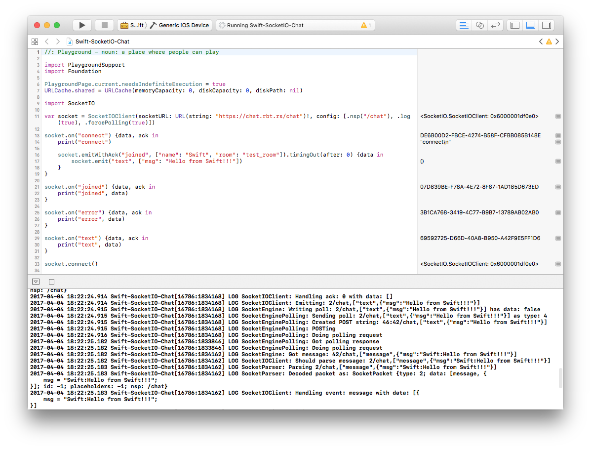

# Swift-SocketIO-Chat

Minimal [socketio/socket.io-client-swift](https://github.com/socketio/socket.io-client-swift) library test with [XCode Interactive Playground](https://developer.apple.com/swift/blog/?id=35) and [CocoaPods](https://cocoapods.org).

Works with [msrdjan/Flask-SocketIO-Chat](https://github.com/msrdjan/Flask-SocketIO-Chat) deployed to test server at https://chat.rbt.rs/, but can be configured to connect to any other SocketIO server by modifying [Swift-SocketIO-Chat.playground/Contents.swift#L11](Swift-SocketIO-Chat.playground/Contents.swift#L11).